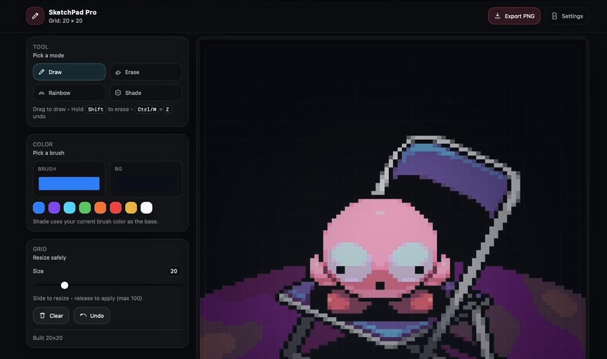
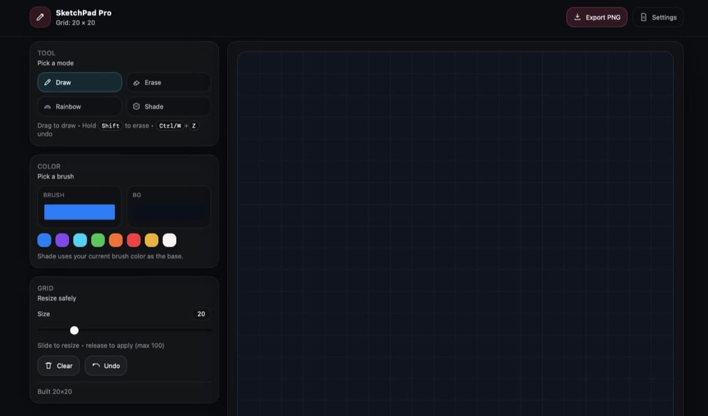

# SketchPad Pro

A modern, responsive **Etch-A-Sketch / Sketchpad** web app built with **vanilla JavaScript, DOM manipulation, and Flexbox** — no frameworks, no CSS Grid.

Designed to feel **hand-crafted**, not auto-generated.

---

## Preview

<p align="center">
  
  
</p>

---

## Features

### Drawing
- Click **and drag** to draw (mouse & touch)
- Smooth **slide-to-draw** using Pointer Events
- Modes:
  - Draw
  - Erase
  - Rainbow
  - Shade (10% darkening per pass)
- Hold **Shift** to erase in any mode

### Colors
- Brush color picker
- Background color picker
- Quick color swatches
- Shade mode uses current brush color as base

### Grid
- Dynamic grid resizing (1–100)
- Responsive scaling (max 960×960, auto scales down)
- No pixel gaps or edge artifacts
- Flexbox-based grid (no CSS Grid)

### Productivity
- **Multi-step Undo** (Ctrl / ⌘ + Z)
- Clear canvas
- Export drawing to **PNG**
- Download settings as **JSON**

---

## Keyboard Shortcuts

| Key | Action |
|----|-------|
| `D` | Draw mode |
| `E` | Erase mode |
| `C` | Clear canvas |
| `Shift` | Temporary erase |
| `Ctrl / ⌘ + Z` | Undo |

---

## Tech Stack

- **HTML5**
- **CSS3** (Flexbox, custom properties, aspect-ratio)
- **Vanilla JavaScript**
- Pointer Events API
- Canvas API (for PNG export)

No frameworks. No libraries.

---

## Project Goals

- Practice **DOM manipulation**
- Build a **state-driven UI**
- Implement real UX patterns (drag, undo stack, touch support)
- Avoid overengineering
- Produce a portfolio-ready mini app

---

## Run Locally

```bash
# No build step required
open index.html
